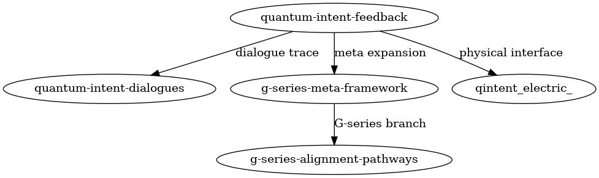

[](https://doi.org/10.5281/zenodo.15258726)


# G-SERIES-ALIGNMENT-PATHWAYS

**Structure-Driven Alignment in Quantum Circuits**  
**구조 기반 양자 회로 정렬 실험**

---

## 🔍 Overview

This repository presents a set of G-series experiments extended to examine whether **structure-induced alignment** can be interpreted without prior knowledge of embedded intent.

본 리포지터리는 G시리즈 실험군 중, 외부 해석자에게도 구조 정렬로 인식될 수 있는 **의도 비삽입 구조 정렬 실험**을 포함합니다.

---

## 📁 Project Structure

```
g-series-alignment-pathways/
├── G-Bx-P/                    # G-B 실험의 구조 정렬 확장
├── G-Ex-P/                    # G-E 실험의 구조 정렬 확장
├── G-Fx-P/                    # G-F 실험의 구조 정렬 확장
├── Gx_Structure_Alignment_Contrast_Experiments.md  # 종합 개요
├── structure_flow_diagram.png                     # 구조 흐름 다이어그램
├── LICENSE
└── README.md
```

---

## 🧪 Summary of Experiments

- **G-Bx-P**: Repetition structure shows high self-alignment and contrast to random forms.  
  구조 반복군은 무작위군 대비 높은 자기정렬을 보이며, 외부 해석자 기준에서도 일관된 양상을 보입니다.

- **G-Ex-P**: Modified feedback loop still aligns outputs without explicit structural cues.  
  피드백 구조만으로도 출력이 정렬되며, 명시적 구조 없이 정렬 신호가 형성됩니다.

- **G-Fx-P**: Structural self-selection observed under random perturbations.  
  구조가 랜덤 조건에서도 반복적으로 자기 선택됨을 보이며, 외부에서도 분기별 정렬 경향을 보입니다.

---

## 📌 Key Concepts

- **Structure as Alignment Cue**: Even absent of intent, repeated structures can guide output.
- **Contrast Experiments**: Compared against random and shuffled baselines.
- **External Interpretability**: Designed to allow structure to be visible to external observers.

---

## 📡 Experimental Structure Flow  
## 📡 실험 흐름 구조도



This diagram shows the branching and contrast-driven flow of extended G-series alignment experiments.  
이 도식은 G시리즈 확장 실험의 분기 및 대조 기반 흐름을 보여줍니다.

---

## 🔗 Related Repositories

- [`quantum-intent-feedback`](https://github.com/anon0411/quantum-intent-feedback)  
- [`g-series-meta-framework`](https://github.com/anon0411/g-series-meta-framework)  
- [`quantum-intent-dialogues`](https://github.com/anon0411/quantum-intent-dialogues)

---

## ⚖️ License

This repository is licensed under the Creative Commons Attribution 4.0 (CC BY 4.0).  
See the [LICENSE](./LICENSE) file for details.

---

_Last updated: 2025-04-22 – Initial README with experimental summary, topic tags, and diagram link._

